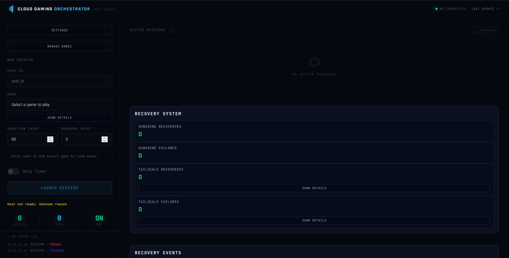
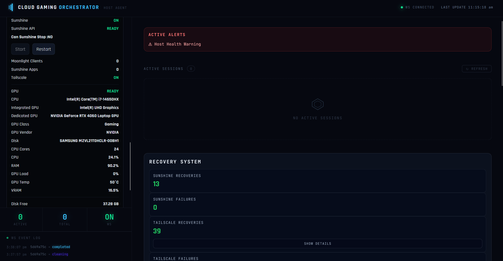
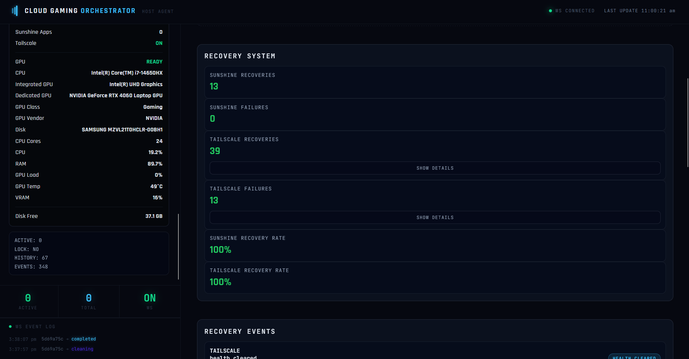
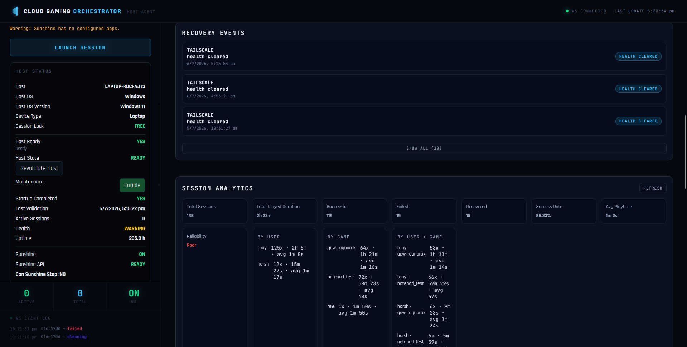
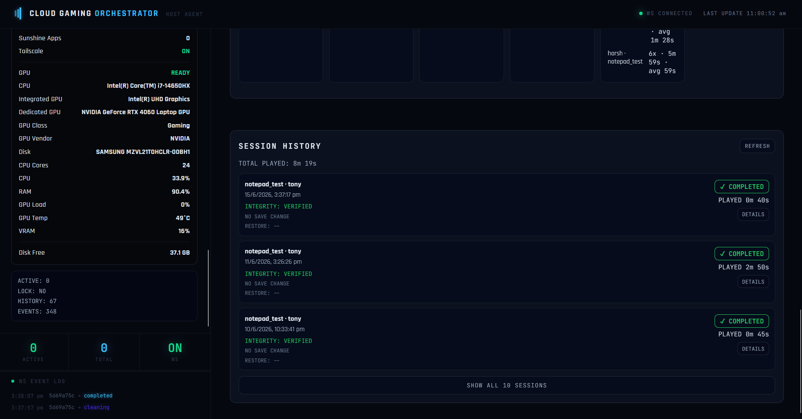
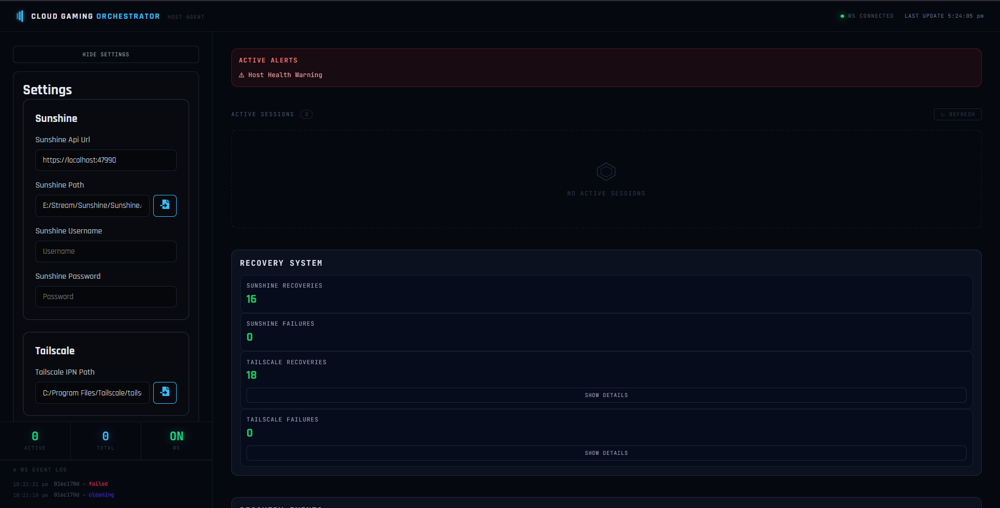
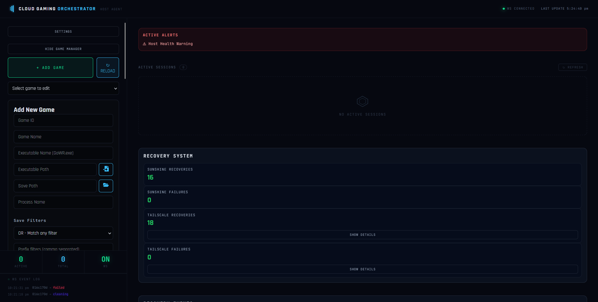
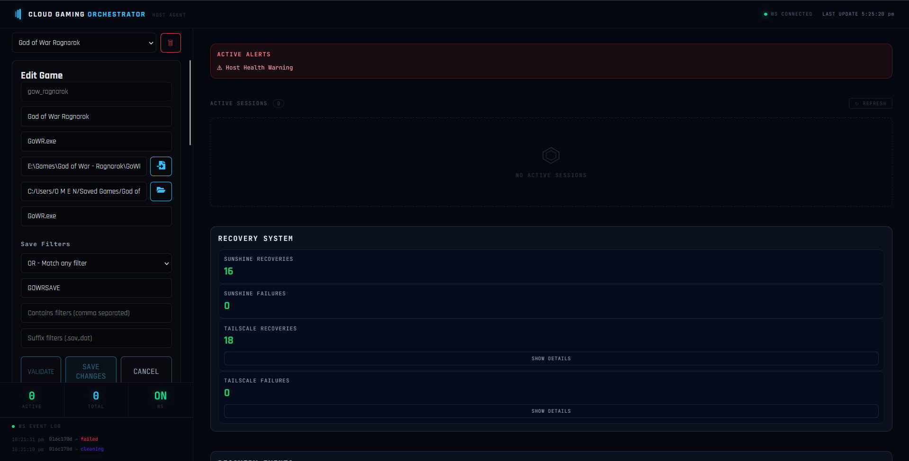
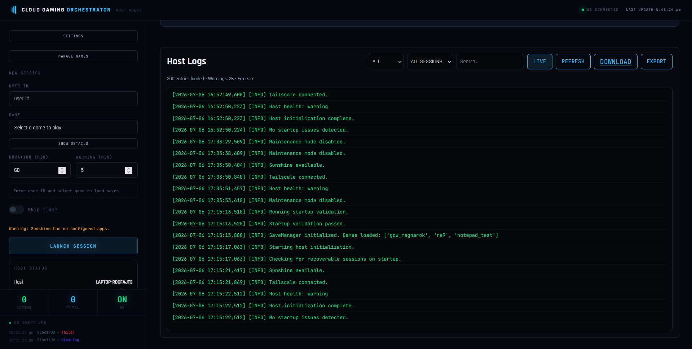

# Personal Cloud Gaming Orchestrator v0.1

Personal Cloud Gaming Orchestrator is a single-host cloud gaming platform that transforms a Windows gaming PC into a remotely accessible gaming server through session orchestration, save synchronization, monitoring, diagnostics, and automated recovery systems.

---

## Project Overview

Personal Cloud Gaming Orchestrator is designed to provide a reliable self-hosted cloud gaming experience.

Instead of simply remotely connecting to a PC, the platform introduces an orchestration layer responsible for:

* Managing game sessions
* Protecting player save data
* Monitoring host health
* Recovering failed services
* Tracking system events
* Providing a real-time management dashboard

The system focuses heavily on reliability and automation.

---
## Installation Guide

To prepare the system and run the Host Agent and Dashboard, follow these steps carefully.

### Prerequisites

- Operating System: Windows 10 or 11 (64-bit) is required. Note: Sunshine (the streaming server) requires Windows 11 or higher, but the Host Agent can run on Windows 10 for local sessions.

- Python: Version 3.12+. (Python 3.12.13 was released March 3, 2026.) Ensure you have a 64-bit Python from python.org or the Microsoft Store.

- Node.js: Version 20+ (an LTS release). For example, Node 24 (LTS, May 2025) or Node 22 (LTS, April 2024) are supported. Download from nodejs.org.

- Additional Software:

Sunshine: (Optional) Install LizardByte’s Sunshine streaming server only if you plan to use Moonlight clients. Sunshine supports Windows 11+.

Tailscale: (Optional) Install Tailscale if you need remote networking. Tailscale runs on Windows, Linux, macOS, etc. It is not required for local sessions in v0.1.

---

### Clone and Build

Open a Command Prompt or PowerShell with administrator rights (required for some host operations):

```bash
git clone https://github.com/Harsh-C-Hari/personal-cloud-gaming-orchestrator.git

cd personal-cloud-gaming-orchestrator

```

---

### Backend Setup

1. Create/Activate Python Virtual Env (recommended):

```bash
cd host-agent
python -m venv .venv
.\.venv\Scripts\activate     # Windows

```

2. Install Python dependencies:

```bash
pip install -r requirements.txt

```

---

### Frontend Setup

In a second terminal (regular user permissions is fine):

```bash
cd frontend
npm install          # installs Node.js dependencies

```

---

### Running the Project

* Start the Backend: In the backend terminal (administrator):

```bash
cd host-agent

python run.py

```

By default, the Host Agent listens on http://0.0.0.0:8100 for API requests.

---

* Start the Frontend Dashboard: In the frontend terminal:

Open another terminal.

```bash
cd frontend

npm run dev #Ignore Vulnerabilty Errors

```

The dashboard will open in your browser at http://localhost:5173.

---

### Troubleshooting & Tips

* Port Conflicts: If port 8100 is in use, you can change the backend port in run.py. The frontend uses port 5173 by default.

* Firewall/Permissions: Windows may prompt to allow Python in the firewall. Ensure it is allowed on your private/home network.

* Running as Admin: Some operations (e.g. Tailscale injection, editing host networking) require administrator privileges. Always start the backend console as Admin.

* Logs: Use the Dashboard’s Log Viewer panel or check host-agent/logs/ for runtime messages.

* Restarting: Simply restart python run.py after code/config changes. The backend detects config updates at runtime.

---

### Initial Configuration

Before launching your first session:

- Configure the host settings using **Settings** or by editing `config.json`.
- Add at least one game using the **Game Manager** or by editing `games.json`.
- Verify the executable path.
- Verify the save directory.
- Validate the game configuration from the dashboard.

> **Note**
>
> Sunshine and Tailscale are **optional** in the current v0.1 release.
>
> Local session management, save synchronization, monitoring, and recovery features function without them.
>
> Sunshine and Tailscale will become required in future phases as remote streaming workflows become fully integrated into session orchestration.

---

### Project Structure

```text
personal-cloud-gaming-orchestrator/

├── host-agent/          # FastAPI backend & Host Agent
├── frontend/            # React dashboard
├── assets/              # Project screenshots
├── docs/                # Engineering documentation
└── README.md
```

---

### Development Notes

- Backend: FastAPI + Python
- Frontend: React + Vite
- Dashboard updates through REST APIs and WebSockets.
- Runtime configuration changes are supported without restarting the backend where applicable.

---

### Known Limitations (v0.1)

* Single-Host Only: This initial release supports only one gaming host. Multi-host orchestration is excluded (planned later).

* No Authentication: All API endpoints are currently unsecured and assume a trusted LAN or Tailscale network. (Planned for Phase 24.)

* JSON Persistence: The system uses local JSON files for state (no DB). Future versions will migrate to a database (Phase 25).

* Optional Streaming: Sunshine and Tailscale are optional in v0.1. The system will operate on a local host without them.

* Mirroring Code: The administrative dashboard and features (game management, session recovery) are available only via the host dashboard; there is no separate user-facing app in v0.1.

---

## Dashboard Preview

### Current Host Management Dashboard (MVP)

The current dashboard is an engineering-focused host administration interface used for monitoring, diagnostics, reliability testing, configuration management, and recovery validation.

It is designed for single-host administration during the early development phases of the project.

Future phases will introduce dedicated user-facing applications and a production-oriented host dashboard.

---

### Host Overview

The primary administrative interface for monitoring the host, launching gaming sessions, viewing active alerts, and observing overall system health.

The dashboard provides a centralized view of active sessions, recovery statistics, host metrics, and administrative tools.



---

### Host Monitoring & System Information

Displays real-time information about the host machine, including:

- CPU, GPU, RAM, and disk utilization
- Hardware information
- Sunshine service status
- Tailscale connectivity
- Host lifecycle state
- System health indicators

This information is used by the watchdog and recovery systems to determine host availability.



---

### Recovery System & Recovery Events

Provides visibility into the automated recovery infrastructure.

The dashboard tracks:

- Sunshine recovery attempts
- Tailscale recovery attempts
- Recovery failures
- Recovery success statistics
- Recovery event history

These statistics are generated by the Host Agent's self-healing watchdog system.





---

### Session Analytics

Provides historical insights into system usage and reliability, including:

- Session history
- User activity
- Game usage
- Reliability statistics
- Recovery metrics

The analytics interface assists during engineering validation and performance testing.


> **Development Note**
>
> Analytics shown in the screenshots include development fault-injection tests where backend failures were intentionally introduced to validate recovery workflows, stale session handling, automatic cleanup, and crash recovery mechanisms.

---

### Session History

Maintains a persistent history of completed sessions, including:

- Session duration
- Completion status
- User and game information
- Save synchronization status
- Cleanup results

This information supports diagnostics and post-session auditing.



---

### Administrative Settings Panel

The dashboard includes a centralized runtime configuration interface for managing host settings without directly editing configuration files.

Supported capabilities include:

- Sunshine configuration
- Tailscale configuration
- Runtime validation
- Configuration synchronization
- Backend validation feedback
- Automatic configuration reload

The settings system was redesigned to support dynamic configuration updates and validation directly from the administrative dashboard.



---

### Dynamic Game Management

Games can be added, edited, validated, and removed directly through the dashboard without manually modifying `games.json`.

The Game Manager supports:

- Dynamic game registration
- Executable selection
- Save path selection
- Process configuration
- Configurable save filters
- Runtime validation
- Live configuration reload

#### Add New Game

Create new game configurations directly from the dashboard.



#### Edit Existing Game

Modify existing game definitions, update executable locations, adjust save paths, and configure advanced save filtering rules.



---

### Administrative Log Viewer

The built-in log viewer provides engineering visibility into Host Agent operations.

Features include:

- Live log streaming
- Search
- Session filtering
- Log level filtering
- Warning and error statistics
- Automatic scrolling
- Log export
- Full log download

The interface was designed to simplify troubleshooting and operational diagnostics during development and production.



---

## System Architecture

```text
React Dashboard
        |
        v
FastAPI Backend
        |
        v
Controllers / Services
        |
        v
Python Host Agent
        |
        +----------------+
        |                |
        v                v
   Sunshine         Tailscale
        |                |
        +----------------+
                 |
                 v
       Windows Gaming Host
```

---

## Key Engineering Highlights

- State-aware Tailscale recovery with diagnostic-based recovery paths.
- Live save synchronization with gameplay-based change detection.
- Stale session recovery and automatic lock cleanup after backend failures.
- Automated Sunshine watchdog and recovery workflows.
- Real-time monitoring dashboard with WebSocket updates.

---

## Current Capabilities

### Game Management

* Dynamic game registration and configuration
* Runtime configuration updates without backend restart
* Executable and save path validation
* Advanced save filtering with prefix, contains, and suffix rules
* Configuration audit logging
* Native Windows file and directory selection

### Session Management

* Session creation and termination
* Session locking
* Session timers and warnings
* Automatic cleanup
* Session analytics
* Session history
* Session event tracking
* Stale session recovery after crashes

---

### Advanced Save Management

* Save injection before launch
* Automatic backup after sessions
* Save archives and restoration
* Hash-based save change detection
* Live save synchronization every 30 seconds
* Configurable game-specific save filtering
* Prefix, contains, and suffix based file matching
* AND / OR filtering strategies
* Complete save package synchronization

---

### Host Monitoring

* CPU monitoring
* RAM monitoring
* Disk monitoring
* Host health evaluation
* Startup validation
* Lifecycle state management

---

### Game Management

- Game registry
- Configuration management
- Executable validation
- Save path validation

---

### Reliability & Recovery

#### Sunshine Watchdog

Automatic:

* Failure detection
* Restart attempts
* Recovery verification
* Event logging

#### State-Aware Tailscale Recovery

Tailscale recovery is handled using diagnostics rather than a simple restart approach.

Implemented recovery paths for known recoverable states:

* Service stopped → Connection recovery
* Service unavailable/unknown → Process recovery
* NoState backend issues → Tailscale IPN recovery

Authentication-related states requiring user action are intentionally not automated.

---

### Dashboard

React-based dashboard providing:

* Host status
* Session visibility
* Analytics
* Recovery history
* Service status
* Real-time updates using APIs and WebSockets

---

## Engineering Challenges Solved

### Tailscale Recovery Complexity

A major challenge was understanding Tailscale's internal behavior.

Unlike a typical application with a single recovery path, Tailscale consists of multiple components and operational states, where different failure conditions require different recovery strategies.

The final design introduced a diagnostic-based recovery system that detects failure conditions and applies the appropriate recovery workflow.

---

### Dashboard Synchronization & Browser Caching

Frequently requested monitoring APIs were being cached by the browser, causing stale dashboard data.

The issue was solved by implementing cache-control headers on backend responses and disabling browser caching for real-time API requests.

---

### Save Synchronization Reliability

Live synchronization initially produced false save updates due to hash comparison differences and non-gameplay files changing unexpectedly.

The final design:

* Uses consistent hash comparison
* Detects gameplay save changes only
* Synchronizes the complete save package

---

### Crash Recovery & Session Consistency

Backend failures could leave sessions in inconsistent states.

A startup recovery workflow was implemented to:

* Detect stale sessions
* Release stale locks
* Correct session history
* Record recovery information

---

### Settings & Configuration

- Runtime configuration management
- Metadata-driven settings architecture
- Backend validation
- Dynamic configuration synchronization
- Service configuration integration
- Restart requirement indicators

---

## Administrative Features

- Administrative log viewer.
- Session-aware logging.
- Runtime settings management.
- Configuration validation.
- Service configuration visibility.
- Configuration audit logging.

---

## Engineering Case Studies

Detailed investigations of major engineering challenges are available in the documentation:

- [Tailscale State-Aware Recovery](docs/engineering/tailscale-state-recovery.md)
- [Live Sync Architecture Migration](docs/engineering/live-sync-architecture-migration.md)
- [Dashboard Cache Investigation](docs/engineering/dashboard-cache-investigation.md)
- [Save Synchronization Detection Refinement](docs/engineering/save-sync-detection-refinement.md)
- [Save Filter System Migration](docs/engineering/save-filter-system-migration.md)
- [Dynamic Game Management & Runtime Configuration](docs/engineering/dynamic-game-management.md)
- [Settings Validation System](docs/engineering/settings-validation-system.md)
- [Tailscale Configuration Migration](docs/engineering/tailscale-configuration-migration.md)


### Release Hardening & Reliability Improvements

Documents the complete release stabilization process performed before the first public GitHub release.

Topics covered include:

- Atomic filesystem operations
- Live Sync reliability improvements
- Save integrity verification
- Concurrency protection
- Crash recovery
- Configuration hardening
- Independent backend and frontend audit findings
- Final release readiness validation

- [Release Hardening & Reliability Improvements](docs/engineering/release-hardening-and-reliability.md)

---

## Technology Stack

### Backend

* Python
* FastAPI
* Uvicorn

### Frontend

* React
* Vite

### Infrastructure

* Sunshine
* Tailscale
* WebSockets

### Storage

Current MVP:

* JSON-based persistence

Future:

* Database migration planned in Phase 25.

---

## Current Status

Version: v0.1

The current release focuses on host orchestration, reliability, recovery, monitoring, save management, and administrative tooling.

User-facing components such as session reconnection, authentication, dedicated user applications, and user dashboards are planned in upcoming development phases.

Completed:

* Session system
* Save management
* Live save synchronization
* Host monitoring
* Startup validation
* Sunshine integration
* State-aware Tailscale recovery
* Dashboard implementation
* Recovery infrastructure

Current development is focused on:
- Testing and reliability validation
- Documentation
- Deployment preparation
- Transition into Phase 23 development

---

## Development Roadmap

Upcoming phases:

### Phase 23 — Session Persistence & Reconnection

Improve resilience by allowing interrupted sessions to be recovered.

### Phase 24 — Authentication & Authorization

Add protected access and user identity management.

### Phase 25 — Database Migration

Move from JSON persistence to a structured database system.

### Phase 26 — User Application Foundation

Create a dedicated application for remote users.

### Phase 27 — Embedded Tailscale

Simplify remote connectivity and onboarding.

### Phase 28 — Moonlight Automation

Automate the game streaming client workflow.

### Phase 29 — User Dashboard

Introduce a dedicated player-facing dashboard.

### Phase 30 — Production Host Dashboard

Improve operational monitoring and host administration.

### Phase 31 — Security & Audit Logging

Introduce security event tracking and audit trails.

### Phase 32 — Deployment & Packaging

Prepare the platform for simplified installation and distribution.

---

## Documentation

Detailed documentation is available inside the `docs/` directory:

* Overview and project scope
* System architecture
* Feature documentation
* Development history
* API references
* Roadmap
* Portfolio and interview notes

---

## Long-Term Vision

Future versions of the project may explore additional orchestration and infrastructure capabilities, including:

- Multi-host orchestration
- Advanced monitoring
- Enhanced recovery systems
- Distributed infrastructure

---

## Current Project Scope

Personal Cloud Gaming Orchestrator v0.1 is currently a single-host platform.

Features such as public hosting, marketplace systems, billing, and payments are intentionally outside the current scope.

---

## Learning Outcomes

This project provided hands-on experience with:

* Backend architecture
* Frontend dashboard development
* REST API design
* WebSocket communication
* System monitoring
* Reliability engineering
* Service recovery automation
* Debugging complex real-world failures
* Designing resilient software systems

## Platform Support

Personal Cloud Gaming Orchestrator v0.1 currently supports:

- Windows 10
- Windows 11

The host platform relies on:

- Sunshine
- Windows process management
- Windows GPU monitoring
- Windows save locations

Linux and macOS host support are not currently supported.

## Security Notice

The host agent currently listens on all network interfaces to support Tailscale and remote clients.
The v0.1 release currently assumes the Host Dashboard operates within a trusted environment.

Authentication and authorization are planned for Phase 24.

Administrative configuration endpoints should not be exposed directly to untrusted networks.