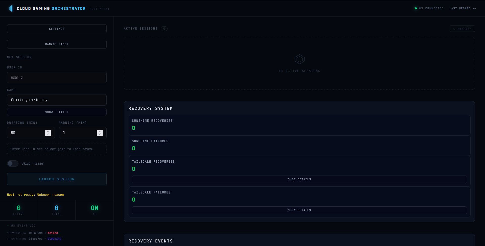
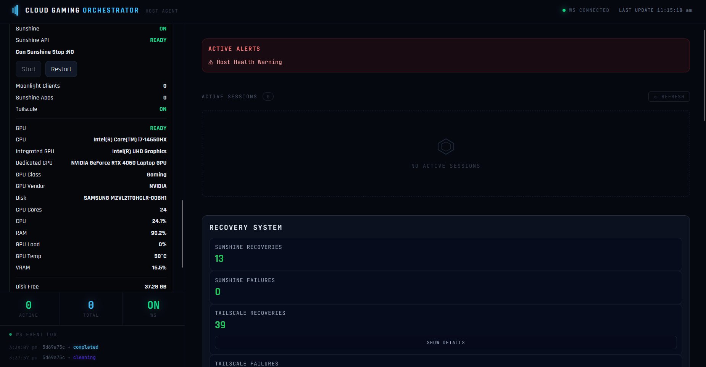
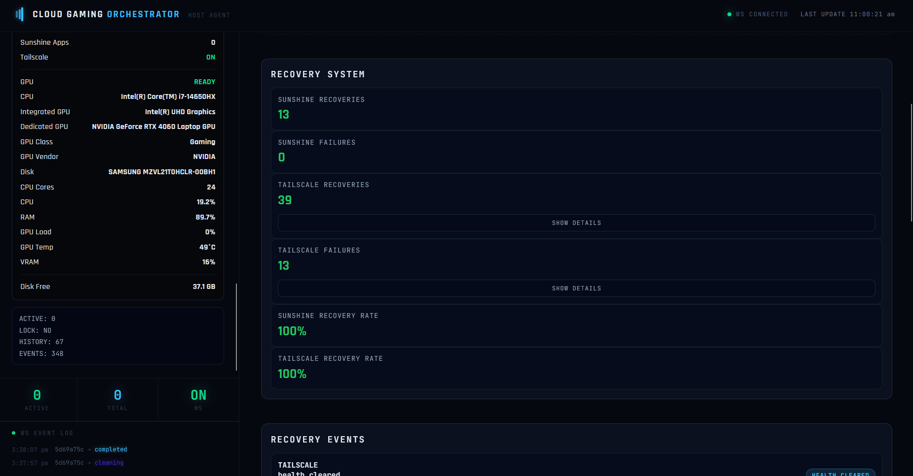
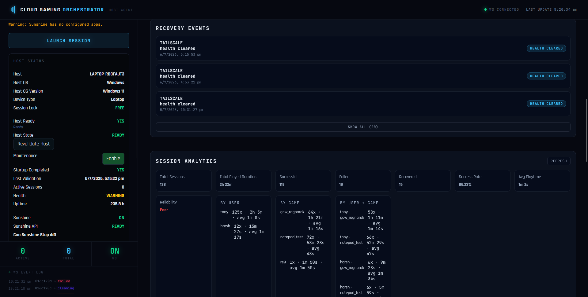
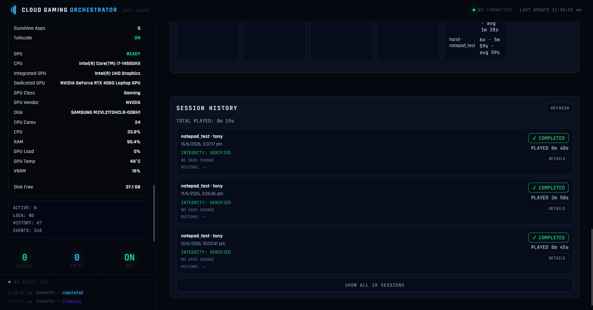
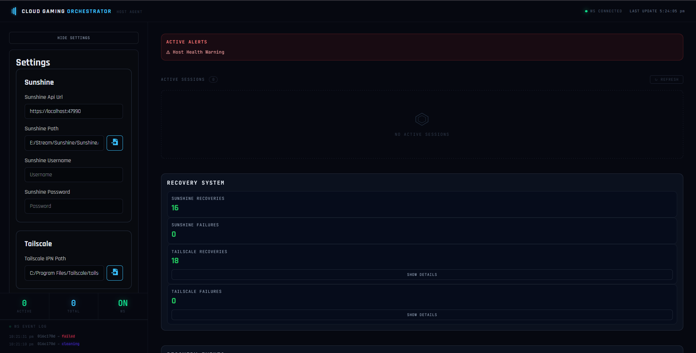
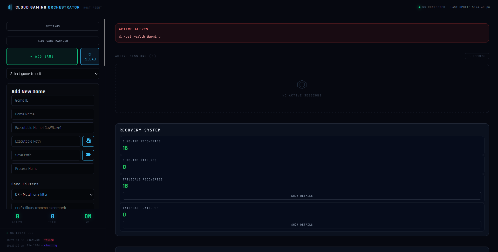
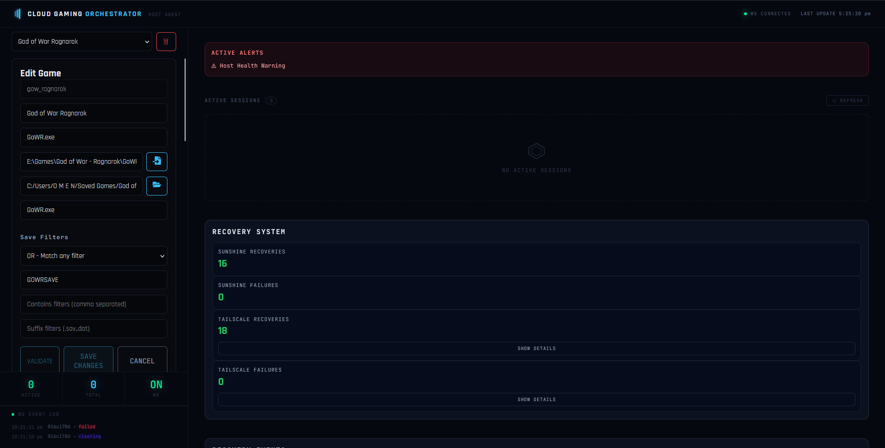
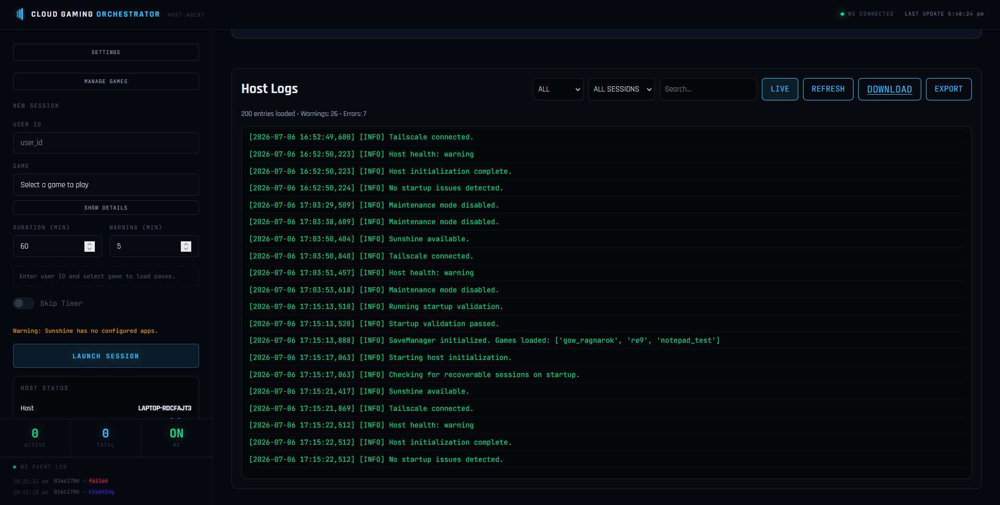

# Personal Cloud Gaming Orchestrator v0.1

Personal Cloud Gaming Orchestrator is a single-host cloud gaming orchestration platform that transforms a Windows gaming PC into a remotely accessible gaming server through session orchestration, save synchronization, monitoring, diagnostics, authentication, and automated recovery systems.

---

## Project Overview

Personal Cloud Gaming Orchestrator is designed to provide a reliable self-hosted cloud gaming experience.

Instead of simply remotely connecting to a PC, the platform introduces an orchestration layer responsible for:

* Managing game sessions
* Protecting player save data
* Authenticating and authorizing users
* Monitoring host health
* Recovering failed services
* Tracking system events
* Providing role-based, real-time management dashboards for both administrators and regular users

The system focuses heavily on reliability, security, and automation.

---
## Installation Guide

To prepare the system and run the Host Agent and Dashboard, follow these steps carefully.

### Prerequisites

- **Operating System:** Windows 10 or Windows 11 (64-bit)

- **Python:** Python 3.10 or newer (64-bit).
  - This project was developed and tested using **Python 3.10.11**.
  - Newer Python versions may work, but compatibility depends on third-party libraries. If you encounter installation issues, Python **3.10.x** is the recommended version for v0.1.

- **Node.js:** Node.js 20+ (LTS recommended)
  - Developed and tested with Node.js 24.14.1.

- **Additional Software (Optional):**
  - Sunshine (required only for remote streaming)
  - Tailscale (required only for remote networking)

---

### Verified Development Environment

The project has been developed and tested with the following environment:

| Component | Version |
|----------|---------|
| Windows | Windows 11 |
| Python | 3.10.11 |
| Node.js | 24.14.1 |
| npm | 11.14.1 |
| FastAPI | 0.135.3 |
| Uvicorn | 0.35.0 |

---

### Clone and Build

Open a Command Prompt or PowerShell with administrator rights (required for some host operations):

```bash
git clone https://github.com/Harsh-C-Hari/personal-cloud-gaming-orchestrator.git

cd personal-cloud-gaming-orchestrator

```

---

### Backend Setup

1. Create/Activate Python Virtual Env (recommended):

```bash
cd host-agent
python -m venv .venv
.\.venv\Scripts\activate     # Windows

```

2. Install Python dependencies:

```bash
pip install -r requirements.txt

```

Backend authentication dependencies (`passlib[bcrypt]`, `python-jose[cryptography]`) are included in `requirements.txt` and installed automatically.

---

### Frontend Setup

In a second terminal (regular user permissions is fine):

```bash
cd frontend
npm install          # installs Node.js dependencies
                     # ignore Vulnerabilty Errors
```

---

### Running the Project

* Start the Backend: In the backend terminal (administrator):

```bash
cd host-agent

python run.py

```

By default, the Host Agent listens on http://0.0.0.0:8100 for API requests.

---

* Start the Frontend Dashboard: In the frontend terminal:

Open another terminal.

```bash
cd frontend

npm run dev

```

Open your browser and navigate to:

http://localhost:5173

---

### First-Run Account Bootstrap

The Host Agent requires at least one administrator account before the dashboard can be used.

On first launch, the dashboard detects that no admin account exists (`GET /auth/bootstrap-required`) and presents a one-time **Create Admin Account** screen instead of the normal login form. Once the initial administrator is created, this screen never appears again, and all subsequent access goes through the standard login form.

Additional accounts (admin or standard user) can be created afterward from **User Management** in the admin dashboard.

---

### Troubleshooting & Tips

* Port Conflicts: If port 8100 is in use, you can change the backend port in run.py. The frontend uses port 5173 by default.

* Firewall/Permissions: Windows may prompt to allow Python in the firewall. Ensure it is allowed on your private/home network.

* Running as Admin: Some operations (e.g. Tailscale injection, editing host networking) require administrator privileges. Always start the backend console as Admin.

* Logs: Use the Dashboard's Log Viewer panel or check host-agent/logs/ for runtime messages. Standard users see only their own session logs (**My Logs**); administrators see the full host log.

* Restarting: Simply restart python run.py after code/config changes. The backend detects config updates at runtime.

---

## Running Tests

The frontend includes automated tests to verify core dashboard functionality and UI behavior.

Run the test suite from the frontend directory:

```bash
cd frontend

npm run test
```

Current test coverage includes:

- Dashboard components
- Session management UI
- Authentication flow
- Host monitoring components
- User/Admin dashboard routing
- Shared utilities

**Current Test Suite**

- 21 automated frontend tests

Run the test suite after making frontend changes to verify that existing functionality has not been affected.

---

### Initial Configuration

Before launching your first session:

- Complete the first-run admin bootstrap (see above) and log in.
- Configure the host settings using **Settings** or by editing `config.json`.
- Add at least one game using the **Game Manager** or by editing `games.json`.
- Verify the executable path.
- Verify the save directory.
- Validate the game configuration from the dashboard.

> **Note**
>
> Sunshine and Tailscale are **optional** in the current v0.1 release.
>
> Local session management, save synchronization, monitoring, authentication, and recovery features function without them.
>
> Sunshine and Tailscale become required once remote streaming is actually used, but do not block local session launch.

---

### Project Structure

```text
personal-cloud-gaming-orchestrator/

├── host-agent/          # FastAPI backend & Host Agent
│   ├── api/              # Routes, services, auth, session registry, websocket manager
│   └── host_agent/        # Host-side managers (sessions, saves, sunshine, tailscale, auth, etc.)
├── frontend/            # React dashboard (admin + user)
│   └── src/dashboard/     # Role-aware dashboard shell, pages, layout, hooks
├── assets/              # Project screenshots
├── docs/                # Engineering documentation
└── README.md
```

---

### Development Notes

- Backend: FastAPI + Python
- Frontend: React + Vite
- Authentication: JWT bearer tokens (python-jose) with bcrypt-hashed passwords (passlib)
- Dashboard updates through REST APIs and WebSockets.
- Runtime configuration changes are supported without restarting the backend where applicable.

---

### Known Limitations (v0.1)

* Single-Host Only: This initial release supports only one gaming host. Multi-host orchestration is excluded (planned later).

* Persistence: Session history, session events, session metadata, recovery events, Sunshine stream history/state, and user accounts are stored in a local SQLite database (`host-agent/data/pcgo.db`). Host configuration (`config.json`), the game library (`games.json`), and the in-flight active-session snapshot used for crash recovery (`data/active_sessions.json`) intentionally remain JSON files rather than database tables.

* Optional Streaming: Sunshine and Tailscale are optional in v0.1. The system will operate on a local host without them.

* Dashboard-Only Client: Both administrators and standard users interact with the platform through the same web dashboard (role-aware, not a separate codebase). A dedicated lightweight/mobile-friendly user application is planned for a future phase.

---

### Authentication & Authorization

Authentication and role-based authorization are implemented in the current release.

Current capabilities include:

- First-run administrator bootstrap (`/auth/bootstrap-required`, `/auth/bootstrap-admin`)
- JWT-based login (`/auth/login`), bearer tokens on every API request
- Two roles: **admin** and **user**
- Admin-only user management (create, list, delete users; delete-all-except-oldest-admin safety operation)
- Self-service password change for any logged-in user
- Per-role dashboard: administrators get the full host-management dashboard; standard users get a scoped dashboard limited to their own sessions, analytics, history, and logs
- Passwords are hashed with bcrypt (passlib); tokens are signed HS256 JWTs with a configurable expiry (`config.json` → `auth.access_token_expire_minutes`, default 1440 minutes)

A separate, narrower authentication mechanism (a shared internal event token, distinct from user JWTs) protects the small set of endpoints that Sunshine's own hook script and the transport-monitoring background thread call directly — see [Internal Event Authentication](docs/engineering/internal-event-authentication.md).

---

## Dashboard Preview

### Current Host Management Dashboard (MVP)

The dashboard is a role-aware web application served to both administrators and standard users. Administrators see a full host-administration interface used for monitoring, diagnostics, reliability testing, configuration management, and recovery validation. Standard users see a scoped dashboard limited to starting/viewing their own sessions, their own analytics, their own session history, and their own logs.

---

### Login & Account Bootstrap

The dashboard opens on a login screen. On a fresh install (no admin account yet), it instead presents a one-time admin account creation screen. After login, JWT tokens govern access to every API request, and the dashboard routes to the Admin or User experience automatically based on the account's role.

---

### Host Overview

The primary administrative interface for monitoring the host, launching gaming sessions, viewing active alerts, and observing overall system health.

The dashboard provides a centralized view of active sessions, recovery statistics, host metrics, and administrative tools.



---

### Host Monitoring & System Information

Displays real-time information about the host machine, including:

- CPU, GPU, RAM, and disk utilization
- Hardware information
- Sunshine service status
- Tailscale connectivity
- Host lifecycle state
- System health indicators

This information is used by the watchdog and recovery systems to determine host availability. Standard users see a reduced, non-sensitive view of the same readiness information via `GET /host/user-status`.



---

### Recovery System & Recovery Events

Provides visibility into the automated recovery infrastructure.

The dashboard tracks:

- Sunshine recovery attempts
- Tailscale recovery attempts
- Recovery failures
- Recovery success statistics
- Recovery event history

These statistics are generated by the Host Agent's self-healing watchdog system.





---

### Sunshine Streaming & Client Management

The admin dashboard includes a dedicated **Sunshine** page covering more than basic service control:

- Sunshine service start / stop / restart
- Paired client visibility, and the ability to unpair a single client or unpair all clients
- Live stream status (active stream, connected client, transport connection state)
- Persistent stream history (start/stop times, per-stream duration)
- Manual "close stream" action for a stuck stream

See [Sunshine Client Management & Stream Tracking](docs/engineering/sunshine-client-management.md) for the internal architecture.

---

### Session Analytics

Provides historical insights into system usage and reliability, including:

- Session history
- User activity
- Game usage
- Reliability statistics
- Recovery metrics

The analytics interface assists during engineering validation and performance testing. Standard users see the same analytics page scoped to their own sessions only.


> **Development Note**
>
> Analytics shown in the screenshots include development fault-injection tests where backend failures were intentionally introduced to validate recovery workflows, stale session handling, automatic cleanup, and crash recovery mechanisms.

---

### Session History

Maintains a persistent history of completed sessions, including:

- Session duration
- Completion status
- User and game information
- Save synchronization status
- Cleanup results

This information supports diagnostics and post-session auditing.



---

### Administrative Settings Panel

The dashboard includes a centralized runtime configuration interface for managing host settings without directly editing configuration files.

Supported capabilities include:

- Sunshine configuration
- Tailscale configuration
- Runtime validation
- Configuration synchronization
- Backend validation feedback
- Automatic configuration reload

The settings system was redesigned to support dynamic configuration updates and validation directly from the administrative dashboard.

Some configuration changes are applied immediately, while selected storage and host-agent settings require a backend restart. The dashboard indicates when a restart is required.



---

### Dynamic Game Management

Games can be added, edited, validated, and removed directly through the dashboard without manually modifying `games.json`.

The Game Manager supports:

- Dynamic game registration
- Executable selection
- Save path selection
- Process configuration
- Configurable save filters
- Runtime validation
- Live configuration reload

#### Add New Game

Create new game configurations directly from the dashboard.



#### Edit Existing Game

Modify existing game definitions, update executable locations, adjust save paths, and configure advanced save filtering rules.



---

### User Management (Admin)

Administrators can manage accounts directly from the dashboard's **User Management** page:

- Create new admin or standard user accounts
- List all accounts with role and creation date
- Delete an individual account
- Bulk-remove all accounts except the oldest admin (recovery safety operation, e.g. after test-account cleanup)

Every user (admin or standard) can change their own password from **Settings → Change Password**.

---

### Administrative Log Viewer

The built-in log viewer provides engineering visibility into Host Agent operations.

Features include:

- Live log streaming
- Search
- Session filtering
- Log level filtering
- Warning and error statistics
- Automatic scrolling
- Log export
- Full log download

Administrators see the complete host log (`/admin/logs`, `/admin/logs/download`). Standard users see a filtered view scoped to their own sessions only (`/admin/my-logs`, `/admin/my-log-sessions`, `/admin/my-logs/download`).

The interface was designed to simplify troubleshooting and operational diagnostics during development and production.



---

## System Architecture

```text
React Dashboard (Login / Bootstrap → Admin or User shell)
        |
        v
FastAPI Backend  (JWT auth on every route)
        |
        v
Controllers / Services
        |
        v
Python Host Agent
        |
        +----------------+
        |                |
        v                v
   Sunshine         Tailscale
        |                |
        +----------------+
                 |
                 v
       Windows Gaming Host
```

---

## Key Engineering Highlights

- JWT-based authentication with role-based (admin/user) API and dashboard separation.
- A dedicated shared-secret "internal event token" that authorizes Sunshine's own hook script and the log-tailing transport monitor to report stream state, without exposing that path to logged-in users.
- State-aware Tailscale recovery with diagnostic-based recovery paths.
- Live save synchronization with gameplay-based change detection.
- Stale session recovery and automatic lock cleanup after backend failures.
- Automated Sunshine watchdog and recovery workflows, plus Sunshine client pairing management and persisted stream history.
- Session status updates pushed to the dashboard over WebSocket, with host monitoring and recovery data refreshed via REST polling.

---

## Current Capabilities

### Authentication & User Management

* First-run administrator bootstrap
* JWT login with bcrypt-hashed passwords
* Role-based access control (admin / user) enforced on every API route
* Admin user management (create, list, delete, bulk cleanup)
* Self-service password change
* Role-aware dashboard routing (Admin Dashboard vs. User Dashboard)

### Game Management

* Dynamic game registration and configuration
* Runtime configuration updates without backend restart
* Executable and save path validation
* Advanced save filtering with prefix, contains, and suffix rules
* Configuration audit logging
* Native Windows file and directory selection

### Session Management

* Session creation and termination
* Session locking
* Session timers and warnings
* Automatic cleanup
* Session analytics (admin: all sessions; user: own sessions only)
* Session history
* Session event tracking
* Stale session recovery after crashes

---

### Advanced Save Management

* Save injection before launch
* Automatic backup after sessions
* Save archives and restoration
* Hash-based save change detection
* Live save synchronization every 15 seconds
* Configurable game-specific save filtering
* Prefix, contains, and suffix based file matching
* AND / OR filtering strategies
* Complete save package synchronization

---

### Host Monitoring

* CPU monitoring
* RAM monitoring
* Disk monitoring
* Host health evaluation
* Startup validation
* Lifecycle state management
* Separate admin (`/host/status`, `/host/metrics`) and user (`/host/user-status`) views

---

### Sunshine Integration

* Start / stop / restart control
* Status, reachability, and application/client counts
* Client pairing, unpairing, and unpair-all
* Stream state tracking (active stream, connected client, transport connection)
* Persisted stream history with manual "close stream" recovery action
* Log-tailing transport monitor for connect/disconnect detection
* Startup validation and automated watchdog recovery
* Internal event token authentication securing the hook/monitor-only endpoints

---

## Session Persistence & Recovery

The v0.1 release includes persistent session infrastructure capable of:

- Recovering sessions after backend restarts
- Restoring session monitoring threads
- Restoring timers and expiration state
- Restoring Live Sync operations
- Preserving save ownership

This architecture forms the basis for future reconnect support and cloud gaming functionality.

---

### Reliability & Recovery

#### Sunshine Watchdog

Automatic:

* Failure detection
* Restart attempts
* Recovery verification
* Event logging

#### State-Aware Tailscale Recovery

Tailscale recovery is handled using diagnostics rather than a simple restart approach.

Implemented recovery paths for known recoverable states:

* Service stopped → Connection recovery
* Service unavailable/unknown → Process recovery
* NoState backend issues → Tailscale IPN recovery

Authentication-related states requiring user action are intentionally not automated.

---

### Dashboard

React-based, role-aware dashboard providing:

* Host status (admin) / host readiness (user)
* Session visibility, scoped by role
* Analytics
* Recovery history (admin)
* Service status
* User management (admin)
* Real-time updates using APIs and WebSockets

---

## Engineering Challenges Solved

### Tailscale Recovery Complexity

A major challenge was understanding Tailscale's internal behavior.

Unlike a typical application with a single recovery path, Tailscale consists of multiple components and operational states, where different failure conditions require different recovery strategies.

The final design introduced a diagnostic-based recovery system that detects failure conditions and applies the appropriate recovery workflow.

---

### Dashboard Synchronization & Browser Caching

Frequently requested monitoring APIs were being cached by the browser, causing stale dashboard data.

The issue was solved by implementing cache-control headers on backend responses and disabling browser caching for real-time API requests.

---

### Save Synchronization Reliability

Live synchronization initially produced false save updates due to hash comparison differences and non-gameplay files changing unexpectedly.

The final design:

* Uses consistent hash comparison
* Detects gameplay save changes only
* Synchronizes the complete save package

---

### Crash Recovery & Session Consistency

Backend failures could leave sessions in inconsistent states.

A startup recovery workflow was implemented to:

* Detect stale sessions
* Release stale locks
* Correct session history
* Record recovery information

---

### Settings & Configuration

- Runtime configuration management
- Metadata-driven settings architecture
- Backend validation
- Dynamic configuration synchronization
- Service configuration integration
- Restart requirement indicators

---

### Authenticating Non-User Callers

Two of Sunshine's own components — the stream hook script it invokes directly, and a background thread that tails Sunshine's log file — need to report stream state back into the backend, but neither is a logged-in user and neither should ever hold a user JWT. A separate shared-secret token, generated at startup and stored in `config.json`, authorizes exactly these calls and nothing else. See [Internal Event Authentication](docs/engineering/internal-event-authentication.md).

---

## Administrative Features

- Administrative log viewer (full host log for admins, scoped log for users).
- Session-aware logging.
- Runtime settings management.
- Configuration validation.
- Service configuration visibility.
- Configuration audit logging.
- User account management.

---

## Engineering Case Studies

Detailed investigations of major engineering challenges are available in the documentation:

- [Tailscale State-Aware Recovery](docs/engineering/tailscale-state-recovery.md)
- [Live Sync Architecture Migration](docs/engineering/live-sync-architecture-migration.md)
- [Dashboard Cache Investigation](docs/engineering/dashboard-cache-investigation.md)
- [Save Synchronization Detection Refinement](docs/engineering/save-sync-detection-refinement.md)
- [Save Filter System Migration](docs/engineering/save-filter-system-migration.md)
- [Dynamic Game Management & Runtime Configuration](docs/engineering/dynamic-game-management.md)
- [Settings Validation System](docs/engineering/settings-validation-system.md)
- [Tailscale Configuration Migration](docs/engineering/tailscale-configuration-migration.md)
- [Session Persistence & Reconnection Architecture](docs/engineering/session-persistence-and-reconnection.md)
- [Internal Event Authentication](docs/engineering/internal-event-authentication.md)
- [Sunshine Client Management & Stream Tracking](docs/engineering/sunshine-client-management.md)


### Release Hardening & Reliability Improvements

Documents the complete release stabilization process performed before the first public GitHub release.

Topics covered include:

- Atomic filesystem operations
- Live Sync reliability improvements
- Save integrity verification
- Concurrency protection
- Crash recovery
- Configuration hardening
- Independent backend and frontend audit findings
- Final release readiness validation

- [Release Hardening & Reliability Improvements](docs/engineering/release-hardening-and-reliability.md)

---

## Technology Stack

### Backend

* Python
* FastAPI
* Uvicorn
* python-jose (JWT)
* passlib + bcrypt (password hashing)

### Frontend

* React
* Vite
* Vitest
* React Testing Library

### Infrastructure

* Sunshine
* Tailscale
* WebSockets

### Storage

* SQLite (`host-agent/data/pcgo.db`) — session history, session events, session metadata, recovery events, Sunshine stream history/state, and user accounts.
* JSON files — host configuration (`config.json`), the game library (`games.json`), and the active-session runtime/crash-recovery snapshot (`data/active_sessions.json`).

---

## Current Status

Version: v0.1

The current release focuses on host orchestration, reliability, recovery, monitoring, save management, authentication, and administrative tooling.

Completed:

* Session system
* Save management
* Live save synchronization
* Host monitoring
* Startup validation
* Sunshine integration (including client pairing and stream tracking)
* State-aware Tailscale recovery
* Dashboard implementation (role-aware: admin and user)
* Recovery infrastructure
* Session persistence & reconnection foundation
* Authentication & role-based authorization
* SQLite persistence for session history, session events, session metadata, recovery events, Sunshine stream history/state, and user accounts

Current development is focused on:
- Testing and reliability validation
- Documentation
- Deployment preparation

---

## Project Quality

Current release status:

- 21 automated frontend tests
- Engineering documentation
- Runtime validation
- WebSocket connection for real-time session status
- Static analysis and linting
- Release hardening completed

---

## Development Roadmap

Completed phases:

### Phase 23 — Session Persistence & Reconnection (Completed)

Persistent session registry, session resurrection after backend restart, and lifecycle separation between game, session, stream, and transport state.

### Phase 24 — Authentication & Authorization (Completed)

JWT-based login, bcrypt password hashing, admin/user roles, first-run bootstrap, and role-aware dashboards.

### Phase 25 — Database Migration (Completed)

Migrated session history, session events, session metadata, recovery events, Sunshine stream history/state, and user accounts from JSON files to a SQLite database (`host-agent/data/pcgo.db`). Host configuration (`config.json`), the game library (`games.json`), and the active-session crash-recovery snapshot (`data/active_sessions.json`) were intentionally kept as JSON files rather than migrated.

Upcoming phases:

### Phase 26 — User Application Foundation

Extend the existing role-aware user dashboard into a dedicated, purpose-built application for remote users (beyond the current shared web dashboard).

### Phase 27 — Embedded Tailscale

Simplify remote connectivity and onboarding.

### Phase 28 — Moonlight Automation

Automate the game streaming client workflow.

### Phase 29 — Production User Experience

Refine and expand the user-facing dashboard introduced in Phase 24 toward a production-grade player experience.

### Phase 30 — Production Host Dashboard

Improve operational monitoring and host administration.

### Phase 31 — Security & Audit Logging

Introduce security event tracking and audit trails beyond the current authentication and internal-event-token model.

### Phase 32 — Deployment & Packaging

Prepare the platform for simplified installation and distribution.

---

## Documentation

Detailed documentation is available inside the `docs/` directory:

* Overview and project scope
* System architecture
* Feature documentation
* Development history
* API references
* Roadmap
* Portfolio and interview notes

---

## Long-Term Vision

Future versions of the project may explore additional orchestration and infrastructure capabilities, including:

- Multi-host orchestration
- Advanced monitoring
- Enhanced recovery systems
- Distributed infrastructure

---

## Current Project Scope

Personal Cloud Gaming Orchestrator v0.1 is currently a single-host platform.

Features such as public hosting, marketplace systems, billing, and payments are intentionally outside the current scope.

---

## Learning Outcomes

This project provided hands-on experience with:

* Backend architecture
* Frontend dashboard development
* REST API design
* Authentication & authorization design (JWT, password hashing, role-based access)
* WebSocket communication
* System monitoring
* Reliability engineering
* Service recovery automation
* Debugging complex real-world failures
* Designing resilient software systems

## Platform Support

Personal Cloud Gaming Orchestrator v0.1 currently supports:

- Windows 10
- Windows 11

The host platform relies on:

- Sunshine
- Windows process management
- Windows GPU monitoring (currently NVIDIA GPUs through GPUtil)
- Windows save locations

Linux and macOS host support are not currently supported.

## Security Notice

The host agent currently listens on all network interfaces to support Tailscale and remote clients.

All dashboard and API access requires a valid JWT obtained through `/auth/login`; there is no unauthenticated access to session, save, host, or admin endpoints. A separate, narrowly-scoped shared secret (not a user credential) authorizes the small set of Sunshine hook/transport endpoints described in [Internal Event Authentication](docs/engineering/internal-event-authentication.md).

The v0.1 release does not yet include structured security audit logging (planned for Phase 31) , user accounts currently live in local database `host-agent/data/pcgo.db`.

Administrative configuration endpoints should still not be exposed directly to untrusted networks.
